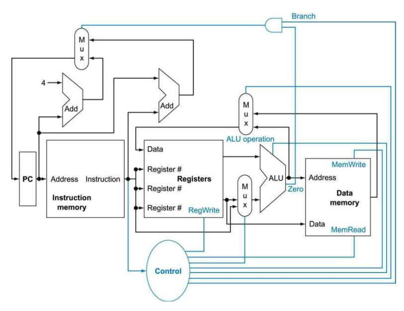
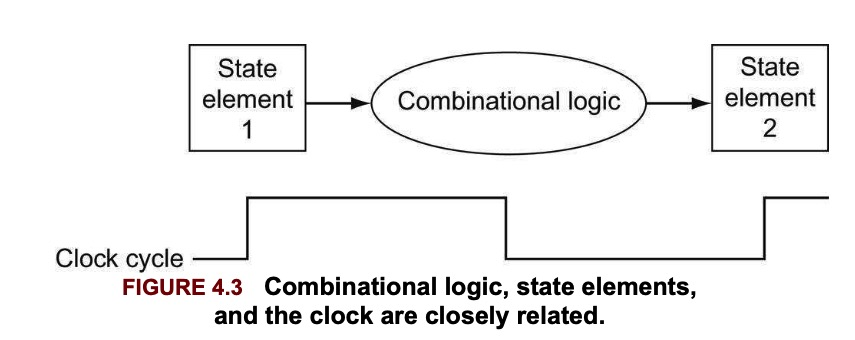

This about RISC-V Processor Datapath

Each instruction reads and updates this state during execution

* Register(x0,.. x31)
  * Register file (or regfile) **Reg** holds 32 registers x 32bits/register: Reg[0]..Reg[31]
* Program Counter (PC):
  * Holds address of current instruction
* Memory(MEM)
  * Holds both instructions and data, in one 32-bit byte-addressed memory space
  * we will use separate memories for instructions (IMEM) and data(DMEM)
  * Instructions are read from instruction memory 
  * load/store instructions access data memory

## 1. Introduction

The implementation of the processor determines both the clock cycle time and the number of clock cycles per instruction. 

A subset of the core RISC-V instruction set:

* The memory-reference instructions: `ld`, `sd`
* The arithmetic-logical instructions `add`, `sub`, `and`, `or`
* The conditional branch instruction `beq`

For every instruction, the first two steps are identical:

1. send the program counter (PC) to the memory that contains the code and fecth the instruction from that memory.
2. read one or two registers, using fields of the instruction to select the registers to read

All instruction classes use the arithmetic-logic unit (ALU) after reading the registers. The memory-reference instructions use the ALU for an address calculation, the arithmetic-logical instructions for the operation execution, and conditional branches for the equality test.

The top multiplexor ("MUX") controls what value replaces the PC (PC+4 or the branch destination address). The multiplexor is controlled by the gate that "ANDs" together the Zero output of the ALU and a control signal that indicates that the instruction is a branch.

The middle multiplexor, whose output returns to the register file, is used to steer the output of the ALU or the output of the data memory for writing into the register file.

The bottom-most multiplexor is used to determine whether the second ALU input is from the registers (for an arithmetic-logical instruction or a branch) or from the offset field of the instruction (for a load or store)

## 2. Logic Design Conventions

### 2.1 combinational and state elements

The data path elements in the RISC-V implementation consist of two different types of logic elements: elements that operate on data values and elements that contain state. The elements that operate on data values are all **combinational**, which means that their outputs depend only on the current inputs. 

An element contains state if it has some internal storage. We call these elements **state elements** because, if we pulled the power plug on the computer, we could restart it accurately by loading the state elements with the values they contained before we pulled the plug. 

A state element has at least two inputs and one output. The required inputs are the data value to be written into the element and the clock, which determines when the data value is written. The output from a state element provides the value that was written in an earlier clock cycle. 

### 2.2 Clocking Methodology

A clocking methodology defines when signals can be read and when they can be written. An edge-triggered clocking methodology means that any values stored in a sequential logic element are updated only on a clock edge, which is a quick transition from low to high or vice versa. 

The inputs are values that were written in a previous clock cycle, while the outputs are the values that can be used in a following clock cycle.

An edge-triggered methodology allows us to read the contents of a register, send the value through some combinational logic, and write that register in the same clock cycle. 