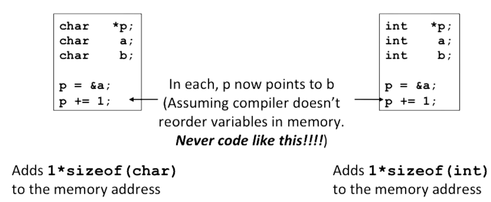
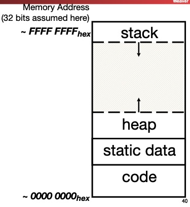
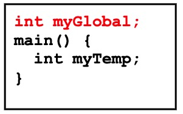
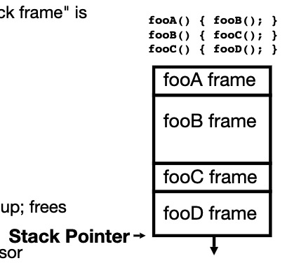
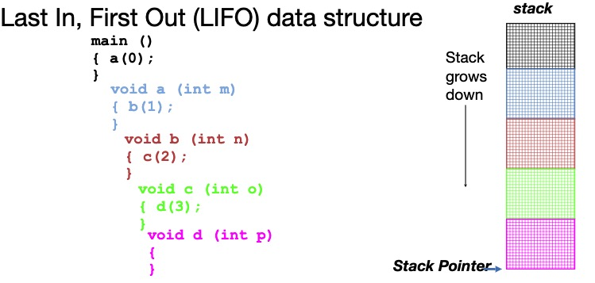
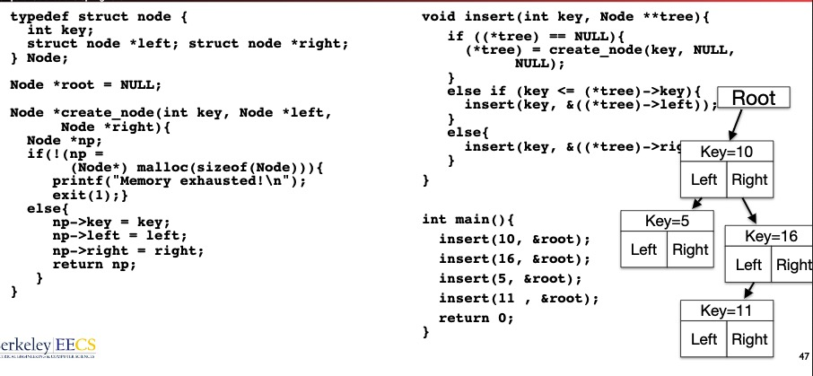

##C vs. Java vs. Python

* Integers
* true or false
* Java and C pass parameters by value

 ## C Arrays

* Declaration:
  `int ar[2];` — just a block of memory 
  `int ar[] = {1, 2}` — declares and initializes a 2-element integer array

### C Arrays are very Primitive

* An array in C does not know its own length, and its bounds are not checked
  * Consequences: we can accidentally access off end of an array
  * Consequences: we must pass the array and its size to any procedure that is going to manipulate it
* Segmentation Fault and Bus Error

### Use Defined Constants

* Bad pattern:

  ```C
  int i, ar[10];
  for (i = 0; i < 10; i++) {...}
  ```

* Better pattern: 

  ```c
  const int ARRAY_SIZE = 10;
  int i, a[ARRAY_SIZE];
  for (i = 0; i < ARRAY_SIZE; i++) {...} 
  ```

  

## C Strings

* String in C is just an array of characters
  `char string[] = "abc";`

* How do we know how long a string is?

  * Last character is followed by a 0 byte (aka "null terminator")

  ```c
  int strlen(char s[])
  {
    int n = 0;
    while (s[n] != 0) n++;
    return n;
  }
  ```

##Pointers

* Pointers are used to point to any kind of data(`int`, `char`, `struct`, etc)
* C knows how to increment pointers 
* `void *` is a type that can point to anything (generic point)
* use `void *` can help avoid program bugs, security issues, and other bad things
* we can even have pointers to functions:
  * `int (* fn)(void *, void *) = &foo`
  * `fn` is a function that accepts two `void *` pointers and returns an `int` and is initially pointing to the function `foo`
  * `(*fn)(x, y)` will call the function

### More C Pointer dangers

* declaring a pointer just allocates space to hold the pointer—does not allocate thing being pointed to.
* Local variables in C are not initialized, they may contain anything 

### Pointer and Structures

```C
typedef struct {
  int x;
  int y;
} Point;

Point p1;
Point p2;
Point *paddr;

/* arrow notation, the two below are equal */
int h = paddr->x;
int h = (*paddr).x;

/* structure assignment */
p2 = p1;
```

Note, C stucture assignment is not a "deep copy". All members are copied, but not things pointed to by members.

### Pointers in C

* Why use pointers?
  - If we want to pass a large struct or array, it's easier/faster to pass a pointer
  - want to modify an object
  - In general, pointers allow cleaner, more compact code
* What are the drawbacks?
  * most problematic with dynamic memory management
  * *dangling reference* and *memory leak*

### Pointing to Differenct Size Objects

* Modern machines are "byte-addressable"
  * hardware's memory composed of 8-bit storage cells, each has a unique address
* A C pointer is just abstracted memory address
* Type declatation tells compiler how many bytes to fetch on each access through pointer
  * E.g., 32-bit integer stored in 4 consecutive 8-bit bytes

### Array Name/ Pointer Duality

* *Key Concept*: Array variable is a "pointer" to the first ($0^{th}$) element
* So, array variables almost identical to pointers
  * `char *string` and `char string[]` are nearly identical declarations
  * Differ in subtle ways: incrementing, declaration of filled arrays
* Consequences:
  * `ar` is an array variable but looks like a pointer
  * `ar[0]` is the same as `*ar`
  * `ar[2] ` is the same as `*(ar+2)`
  * Can use pointer arithmetic to conveniently access arrays
* An array is passed to a function as a pointer, but the array size is lost

```C
int foo(int array[], unsigned int size)
{
  ...array[size-1]...;
  // It will be 8, because array is a pointer
  printf("%d\n", sizeof(array));
}

int main(void) 
{
  int a[10], b[5];
  ...foo(a, 10)...foo(b, 5);
  // It will be 40
  printf("%d\n", sizeof(a));
}
```


### Changing a Pointer Argument

* Solution: Pass a pointer to a pointer, declared as `**h`

```C
void inc_ptr(int **h)
{
  *h = *h + 1;
}

int A[3] = {50, 60, 70};
int *q = A;
inc_ptr(&q);
printf("*q = %d", *q);
```

### sizeof() operator

* sizeof(type) returns number of bytes in object
* By definition, `sizeof(char) == 1`
* Can take any type of data — `sizeof(arr)`, `sizeof(structtype)`

### Pointer arithmetic

pointer + number, pointer - number.



### Arrays and Structures and Pointers

```c
typedef struct bar {
  char *a; /* A pointer to a character */
  char b[18] /* A statically sized array of characters */
} Bar;

Bar *b = (Bar *) malloc(sizeof(struct bar));
b->a = malloc(sizeof(char) * 24);
```

It will require 24 bits on a 32b architecture for the structure:

* 4 bytes for a (pointer)
* 18 bytes for b (18 chars)
* 2 bytes padding (needed to align)

### Concise `strlen()`

```c
int strlen(char *s)
{
  char *p = s;
  while (*p++)
    ; /* Null body of while */
  return p - s - 1;
}
```

## Arguments in `main()`

* To get arguments to the main function, use:

* ```c
  int main(int argc, char *argv[])
  ```

* What does this mean?

  * `argc` contains the number of strings on the command line, here `argc` is 2:

    * ```shell
      unix% sort myFile
      ```

  * `argv` is a pointer to an array containing the arguments as strings

* Example:

* ```shell
  foo hello 87 "bar baz"
  ```

  ```c
  argc = 4;
  argv[0] = "foo";
  argv[1] = "hello";
  argv[2] = "87";
  argv[3] = "bar baz";
  ```

## C Memory Management

* Programs's address space contains 4 regions:

  * **stack**: local variables inside functions, grows downward
  * **heap**: space requested for dynamic data via `malloc()` resizes dynamically, grows upward
  * **static data**: variables declared outside functions, does not grow or shrink. Loaded when program starts, can be modified.
  * **code**: loaded when program starts, does not change

  

### Where are variables allocated?

* If declared outside a function, allocated in "static" storage
* If declared inside function, allocated on the "stack" and freed when function returns

  * `main()` is treated like a function
* For both of these types of memory, the management is automatic




### The stack

* Every time a function is called, a new "stack frame" is allocated on the stack
* Stack frame includes:
  * Return address (who called me?)
  * arguments
  * space for local variables
* Stack frames uses contiguous blocks of memory; stack pointer indicates start of stack frame
* When function ends, stack pointer moves up; free memory for future stack frames





### Managing the Heap

C supports functions for heap management

* `malloc()`: allocate a block of **uninitialized** memory
* `calloc()`: allcoate a block of **zeroed** memory
* `free()`: free previously allocated block of memory
* `realloc()`: change size of previously allocated block

### `Malloc()`

* `void *malloc(size_t n)`:

  * allocate a block of uninitialized memory
  * subsequent calls probably will not yield adjacent blocks
  * `n` is an integer, indicating size of requested memory block in bytes
  * `size_t` is an unsigned integer type big enough to "count" memory bytes
  * Returns `void*` pointer; `NULL` return indicates no more memory (check for it!)
  * additional control information (including size) stored in the heap for each allocated block

* Examples:

* ```c
  int *ip;
  /* "cast" operation changes type of a variable. 
  Here changes (void *) to (int *) */
  ip = (int *) malloc(sizeof(int));
  
  typdef struct {...} TreeNode;
  TreeNode *tp = (TreeNode *) malloc(sizeof(TreeNode));
  ```

### `free()`

* `void free(void *p)`:

  * `p` is a pointer containing the address originally returned by `malloc()`

* Examples:

* ```C
  int *ip;
  ip = (int *) malloc(sizeof(int));
  ...
  free((void*) ip);
  
  typdef struct {...} TreeNode;
  TreeNode *tp = (TreeNode *) malloc(sizeof(TreeNode));
  ...
  free((void*) tp)
  ```



### Observations

* Code, Static storage are easy: they never grow or shrink
* Stack space is relatively easy: stack frames are created and destroyed in LIFO order
* Managing the heap is tricky: memory can be allocated/deallocated at any time
  * If you forget to deallocate memory: "Memory Leak". Your program **will eventually run out of memory**.
  * If you call free twice on the same memory: "Double Free". Possible **crash or exploitable vulnerability**
  * If you use data after calling free: "Use after free". Possible **crash or exploitable vulnerability**

### When Memory Goes Bad

* Writing off the end of arrays:

    ```c
    int *foo = (int *) malloc(sizeof(int) * 100);
    int i;
    ...
    for (i = 0; i <= 100; i++) {
      foo[i] = 0;
    }
    ```

  * Corrupts other parts of the program, including internal C data
  * May cause crashes later
  
* Returning pointers into the stack:

    * It is catastrophically bad to return a pointer to something in the stack.

    * ```c
        char* foo() {
          char foo[50];
          ...
          return foo;
        }
        ```

    * The memory will be overwritten when other functions are called, so your data no longer exists.

* use after free:

    * Reads after the free maybe corrupted, as something else takse over that memory. Your program may get wrong info.
    * writes **corrupt** other data, your program may crashes later.

* Forget realloc can move data:

    * when you realloc it can copy data

    * ```c
        struct foo *f = malloc(sizeof(struct foo) * 10);
        ...
        struct foo *g = f;
        ...
        f = realloc(sizeof(struct foo) * 20);
        ```

    * result is g may now point to invalid memory. Reads may be corrupted and writes may corrupt other pieces of memory.

* Free the wrong stuff:

    * If you `free()` something never malloc'ed(), malloc/free may get confused

* Double free:

### Valgrind

It's a tool that we use to debug C code. 

Valgrind slows down your program a little bit, but it adds a tons of checks designed to catch most memory errors.


