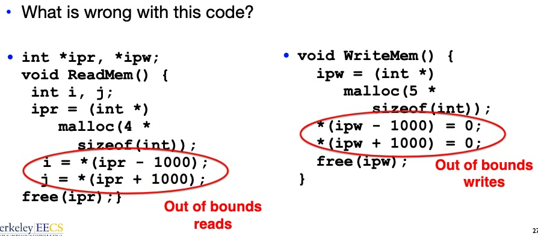
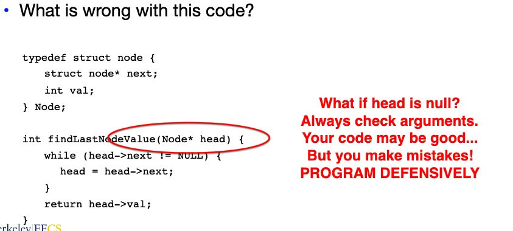
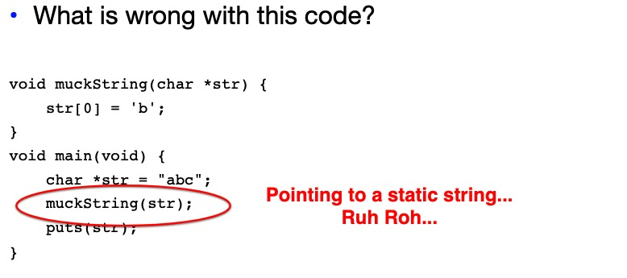
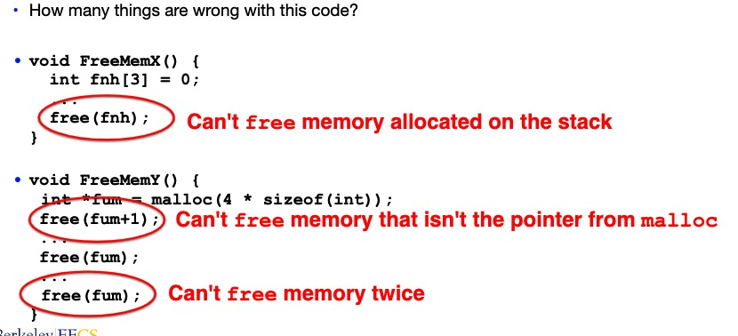
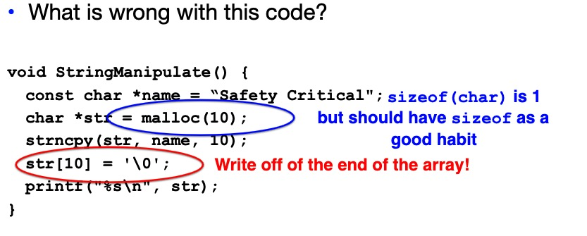

## 1. Pointers and Memory

### 1.1 Pointers to Functions

If we have a function:

```c
char *foo(char *a, int b) {
  ...
}
```

we can create a pointer of that type:

```c
char *(*f)(char *, int);
```

which declares f as a pointer of function taking a `char *` and an `int` and returning a `char *`

Then we can assign to it, which create a reference to function foo

```c
f = &foo;
```

And we can call it:

```c
printf("%s\n", (*f)("cat", 3));
```

It's necessary if you want to write generic code in C.

### 1.2 C unions

```c
union fubar {
  int a;
  char *b;
  void c;
} Fubar;
```

union is accessed just like a struct:

```c
Fubar *f = (Fubar *) malloc(sizeof(union fubar));
f->a = 1312;
f->b = "baz";
```

However, `f->a` and `f->b` are actually the same memory! It is just treated differently by compiler.

Common pattern that we use union:

```c
enum FieldType {a_type, b_type, c_type};
union bar {
  char *a;
  int b;
  float c;
};
struct foo {
  FieldType type;
  union bar data;
};
...
struct foo *f;
...
switch (f->type) {
  case a_type:
    printf("%s\n", f->data.a);
    break;
}
```

### 1.3 How C++ works

C++ is "Object Oriented C".

C++ objects are C structures with an extra pointer at the beginning:

* The "vtable" pointer: Pointing to an array of pointers to functions

For inherited functions:

* To call that function, the compiler writes code that follows the vtable, gets pointer to function, and call that.

### 1.4 How are Malloc/Free implemented?

Underlying operating system allows malloc library to ask for large blocks of memory to use in heap (e.g., using Unix `sbrk()` call)

* This is the reason why your C code, when compiled, is dependent on particular operating system

C standard malloc library creates data structure inside unused portions to track free space:

* This class is about how computers work: How they allocate memory is a huge component

### 1.5 Simple Slow Malloc Implementation


The problem here:

* The memory heirarchy we likes things small and contiguous
* Things start to work badly when stuff is scattered all over the place

### 1.6 Faster malloc implementations

* Keep separate pools of blocks for different sized objects

* "Buddy allocators" always round up to power-of-2 sized chunks to simplify finding correct size and merging neighboring blocks
  * They can just use a simple bitmap to know what is free or occupied.

## 2. Common Memory Problems

Using uninitialized values
### 2.1 Using memory that you don't own:
  * Deallocated stack or heap variable
  * Out-of-bounds reference to stack or heap array
  * using NULL or garbage data as pointer
  * writing to static strings









### 2.2 Improper use of `free/realloc` 

`realloc(p, size)` :

* Resize a previously allocated block at `p` to a new size

* If `p` is NULL, then `realloc` behaves like `malloc`

* if size is 0, then `realloc` behaves like `free`

* returns new address of the memory block; NOTE: it is likely to have moved!

```c
int *ip;
ip = (int *) malloc(10*sizeof(int));
/* always check for ip == NULL */
...
ip = (int *) realloc(ip, 20*sizeof(int));
/* always check NULL, contents of first 10 elements retained */
...
realloc(ip, 0);
```


### 2.3 memory leaks 

you allocated something that you forgot to later free


Memory leaks are not a problem if your program terminates quickly:

* It becomes bigger problem when your program keeps running
* or when you are running on a small embedded system
* It will slow down your program.

Why do memory leaks slow things down?

* memory leaks lead to **fragmentation**
  * as a consequence you use more memory, and its more scattered around
* computers are designed to access **contiguous** memory
  * so things that cause your working memory to be spread out more and in smaller pieces slow things down.





* Valgrind is designed to catch most of these


