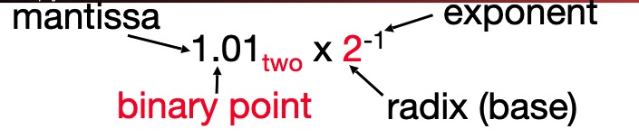
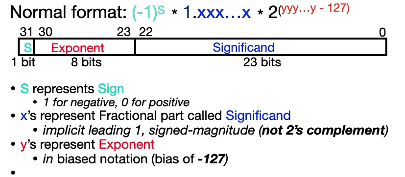
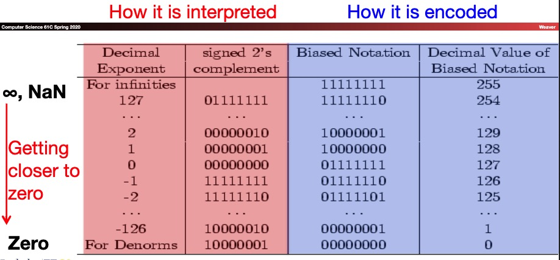
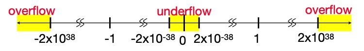
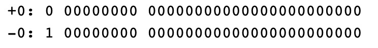
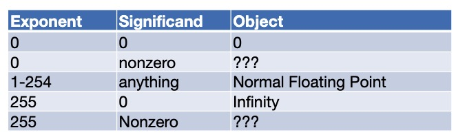
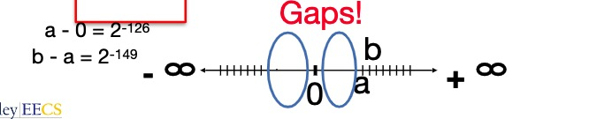

## 1.Floating-Point Representation

### 1.1 Representation of Fractions

Scientific Notation (in Binary):

For single precision, a 32-bit word, can represent number between [2x10e-38, 2x10e38] of [-2x10e38, -2x10e-38]

IEEE 754 single precision Floating-Point Standard:

* 1 bit for **sign(s)** of floating point number
* 8 bits for **exponent(E)**
* 23 bits for **fraction(F)**: (get 1 extra bit for precision because leading 1 is implicit)

$$
(-1)^s  (1+F) 2^E
$$

Double precision Standard(64 bits)

* What if result too large? (> 2x10e38, < -2x10e38):
  * Overflow!
* What if result too small? (>0 & < 2x10e-38, <0 & > -2x10e-38)
  * Underflow!
* 

* what could help reduce chances of overflow or underflow?

### 1.2 two extreme cases: exponents all zeros or all 1s

* What about 0?
  * Bit patterns all 0s means 0 (so no implicit leading 1 in this case)
* what if divide 1 by 0?
  * can get infinity symbols $+ \infin, - \infin$
  * sign bit 0 or 1, largesr exponent(all 1s), 0 in fraction
* what if do something stupid (0/0, $\infin - \infin$)?
  * can get special symbols NaN for "Not a Number"
  * Sign bit 0 or 1, largest exponent (all 1s), not **zero in fraction**

### 1.3 Represent 0:

* exponent all zeros
* significand all zeros
* Sign both + or - is valid
* 
* because it is not really zero!

### 1.4 Representation $+\infin, -\infin$:

* In FP, divide by 0 should produce $+\infin, -\infin$, not overflow
* because it is for further computations with $\infin$: eg, X/0 > Y may be a valid comparison
* significand all zeros

### 1.5 special numbers:

### 1.6 What do I get if calculate sqrt(-4.0) or 0/0:

* thet all get a NaN
* exponent = 255, significand nonzero
* it's helpful because we can use it debug: op(NaN, x) = NaN

### 1.7 Representation for denorms

* Problem: there is a gap among representable FP numbers around 0
  * smallest positive number: a = 1.0... * $2^{-126}$ = $2^{-126}$
  * second smallest: b = 1.000....1 * $2^{-126}$ = (1 + $2^{-23}$) * $2^{-126}$ = $2^{-126}+2^{-129}$
  * 
* Solution:
  * Exponont = 0 , significand nonzero
  * denormalized number : no (implied) leading 1, implicit exponont = -126
  * smallest positive number: a = $2^{-149}(2^{-126} * 2^{-23})$
  * second smallest positive number b = $2^{-148}(2^{-126}*2^{-22})$ 

## 2. Assembly Language

* Basic job of a CPU: execute lots of instructions
* instructions are the primitive operations that the CPU may execute
* Different CPUs implement different sets of instructions. The set of instructions a particular CPU implements is an instruction Set Architecture(ISA)

### 2.1 Instruction Set Architecture

* Early trend was to add more and more instructions to new CPUs to do  elaborate operations
  * VAX architecture had an instruction to multiply polynomials
* RISC (Reduced Instruction Set Computing) philosophy:
  * Keep the instruction set small and simple, makes it easier to build fast hardware
  * Let software do complicated operations by composing simpler ones

### 2.2 From RISC-I to RISC-V

RISC-V (pronounced "risk-five") is a new instruction set architecture (ISA) that was originally designed to support computer architecture research and education. 

All RISCs are mostly the same except for one or two silly design decisions

