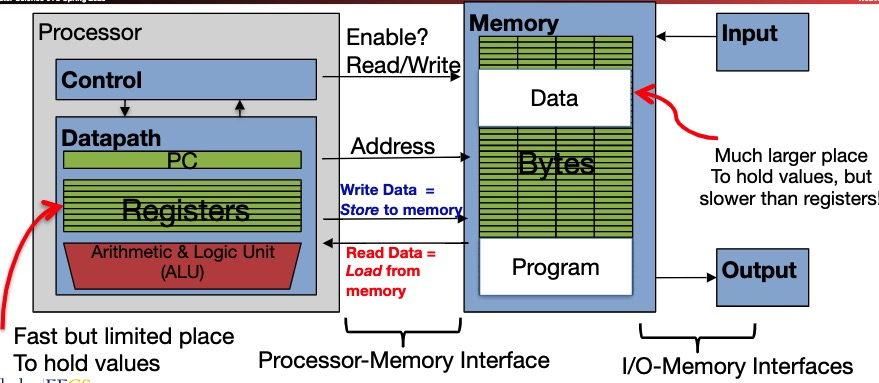

## 1 Assembly Language

### 1.1 Assemebly language programming

* Each assembly language is tied to a particular ISA (fits just a human readable version of machine language)
* Learn to program in assembly language:
  * best way to understand what compilers do to generate machine code
  * best way to understand what the cpu hardware does

### 1.2 Roadmap to Future Classes

* cs164: compilers
  * all the processes in going from source code to assembly
* cs162: O/S
  * OS needs a small amout of assembly for doing things the high level language does not support
* cs152: computer architecture
  * how to build the computer support the assembly
* cs161: security

## 2. Registers

### 2.1 assembly variables: registers

* unlike c or java, assembly does not have variables as you know
  * it's more primitive, instead what simple CPU can directly support
* assembly operands are objects that called **registers**
  * Limited number of special places to hold values, built directly into the hardware
  * arithmetic operations can only be performed on these in a RISC
* Benefit: fast to access

### 2.2 Number of RISC-V Register

* Drawback: registers are in hardware. To keep them really fast, their number is limited
* 32 registers in RISC-V, referred to by number x0-x31:
  * each register is 32 bits wide
  * groups of 32 bits(4 bytes) called a word
* x0 is special, always holds the value zero

### 2.3 Type

* registers have **no type**
* operations determines how register contents are interpreted

### 2.4 Memory alignment

* RISC-V does not require that integers be word aligned, but it is very bad if you don't
* so in practice, RISC-V requires integers to be aligned on 4-byte boundaries

### 2.5 Data Transfer

