It's rigid that each RISC-V arithmetic instruction performs only **one operation** and must always have 3 variables. 

Hardware for a variable number of operands is more complicated for a fixed number.

*Design Principle 1: Simplicity favors regularity*

## 1. Operands of the computer hardware

The operands of arithmetic instructions are restricted, they must be from a limited number of special locations built directly in hardware design called **registers**. 

There are only 32 registers on current computers, like RISC-V.  The reason for the limits of 32 registers is the second design principle of hardware:

*Design Principle 2: Smaller is faster*

 Effective use of registers is critical to program performance.

### 1.1 Memory Operands

The processor can keep only a small amount of data in registers, but computer memory contains billions of data elements. 

Data structures (arrays and structures) are kept in memory.

RISC-V has instructions that tansfer data between memory and registers which are called **data transfer instructions**. 

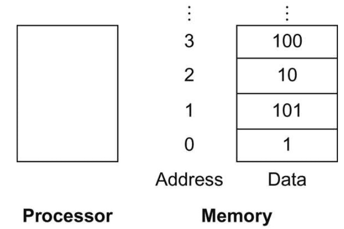

The real name for this instruction is `ld`, standing for *load doubleword*.

Assume `A` is an array of 100 doublewords whose base address is in `x22`, `g` and `h` with registers `x20` and `x21`. Compile this C assigenment statement:

```c
g = h + A[8];
```

```assembly
ld x9, 64(x22)
add x20, x21, x9
```

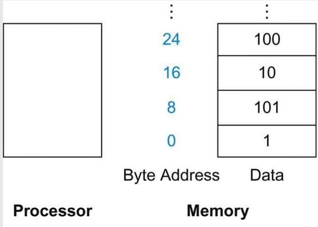

The instruction complementary to load is called store, which is `sd` in RISC-V.

In many architectures, words must start at addresses that are multiples of 4 and doublewords must start at addresses that are multiples of 8. This requirement is called an **alignment restriction**, which leads to faster data transfers.

RISC-V and Intel x86 don't have alignment restrictions, but MIPS does.

Many programs have more variables than computers have registers. Consequently, the compiler tries to keep the most frequently used variables in registers and places the rest in memory, using loads and stores to move variables between registers and memory. The process of putting less frequently used variables (or those needed later) into memory is called **spilling registers**.

### Constant or Immediate Operands

 Many times a program will use a constant in an operation. 

Add immediate or `addi`:

```assembly
addi x22, x22, 4
```

RISC-V dedicates register `x0` to be hard-wired to the value zero.

## 2. Representing Instructions in the Computer

### 2.1 R-type

Most data we work with is in words(32-bit chunks), RISC-V represent instructions as fixed-size 32-bit words.

Translate a RISC-V assembly instruction into a machine instruction:

```assembly
add x9, x20, x21
```

The decimal representation:

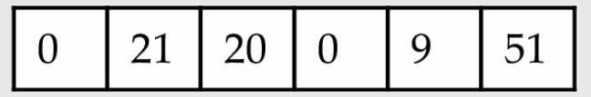

Each of these segements of an instruction is called a *field*. The first, fourth, and sixth fields (0, 0, 51) tell that this instruction performs addition. The second field (21 for `x21`), The third field (20 for `x20`), the fifth field (9 for `x9`).

This instruction can also be represented as fields of binary numbers instead of decimal:

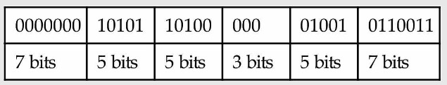

This layout of the instruction is called the **instruction format**. This RISC-V instruction takes exactly 32 bits.

We call the numeric version of instructions **machine language** and a sequence of such instructions *machine code*.

RISC-V Fields:

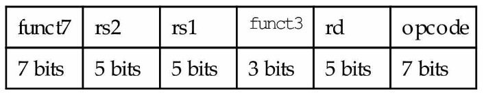

*opcode*: Basic operation of the instruction.

*rd*: The register destination operand

*func3*: an additional opcode field

*rs1*: The first register source operand

*rs2*: The second...

*func7*: an additional opcode field

A problem occurs when an instruction needs longer fields. If we load array from memory that the element index is larger than 31, it will get in trouble. Hence, we have a conflict between the desire to keep all instructions the same length and the desire to have a single instruction format. This conflict leads us to the final hardware design principle:

*Design Principle 3: Good design demands good compromises*

We use distinct instruction formats for different kinds of instructions. The format above is called *R-type* (for register). 

Example:

```assembly
add x18 x19 x10
```

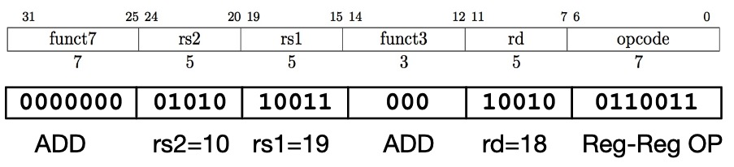

All RV32 R-format instructions:

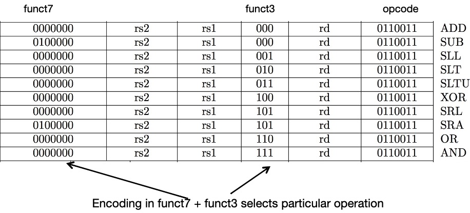

### 2.2 I-type


A second type of instruction format is *I-type* and is used by arithmetic operands with one constant operand, including `addi` and load instructions.

I-type:

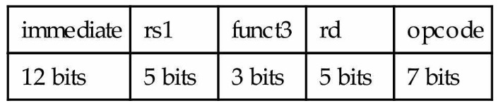


Example:

```assembly
addi x15 x1 -50
```

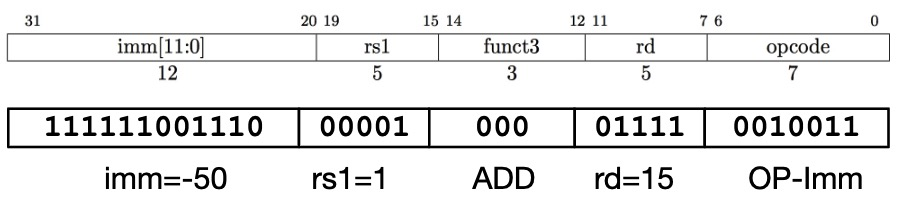

All RV32 I-format Arithmetic/Logical Instructions:
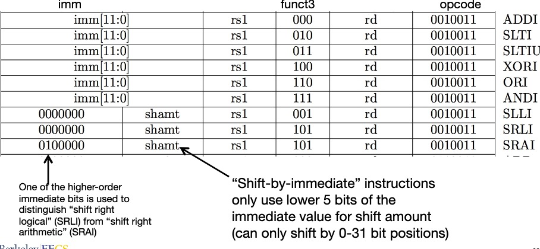

Load instructions are also I-type:

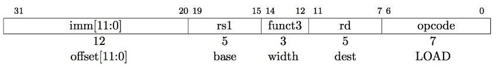

load example:

```assembly
lw x14, 8(x2)
```


All RV32 load instructions

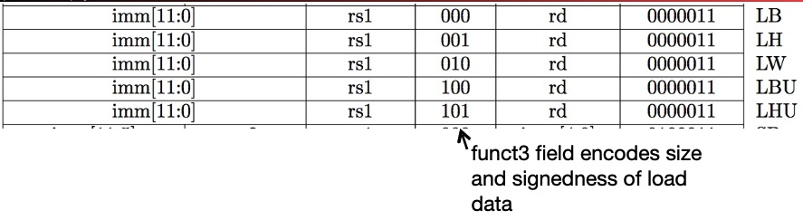


### 2.3 S-type

We also need a format for the store doubleword instruction, `sd`, which needs 2 source registers (for the base address and the store data) and an immediate for the address offset. The field of the *S-type* format are:

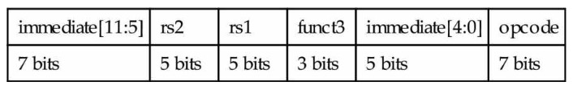

Example:

```assembly
sw x14, 8(x2)
```

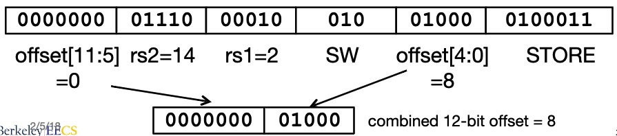

All RV32 Store Instructions:

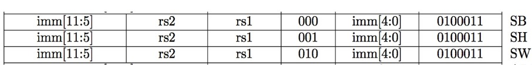

### 2.4 B-type

Instructions stored in a localized area of memory(code/text)

* Largest branch distance limited by size of code
* address of current instruction stored in the program counter

If we don't take the branch:

`PC = PC + 4 ` (next instruction)

If we do take the branch:

`PC = PC + immediate` (immediate is the number of bytes to jump)

B-format:

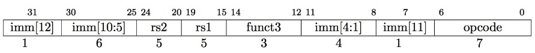

The 12 immediate bits encode 13-bit signed byte offsets (lowest bit of offset is always zero, no need to store it)

Example:

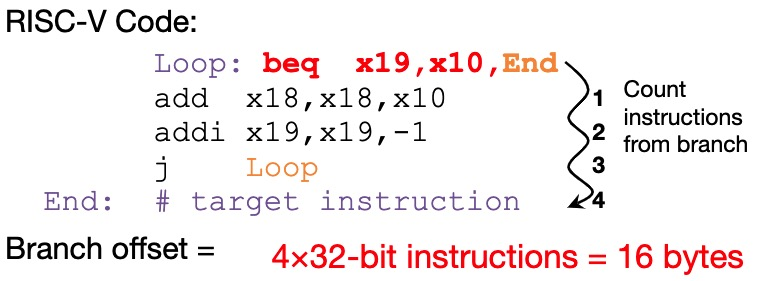

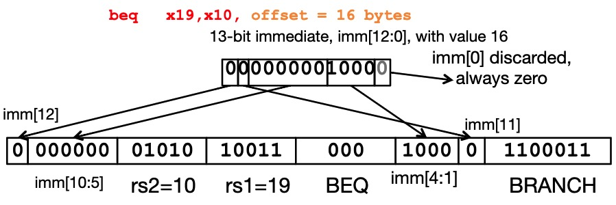

All RISC-V Branch Instructions

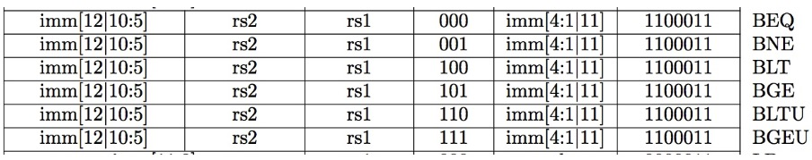

### 2.5 U-type

U-format for upper immediate instructions

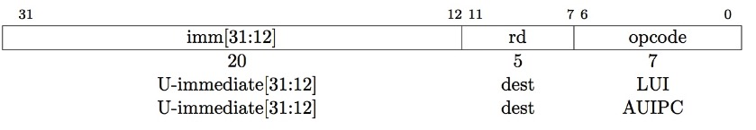

Used for 2 instructions:

* `LUI`: load upper immediate
* `AUIPC`: add upper immediate to PC

`LUI` writes the upper 20 bits of the destination with immediate value, and clears the lower 12 bits. Together with `ADDI` to set low 12bits, can create any 32-bit value.

```assembly
LUI x10 0x87654			# x10 = 0x87654000
ADDI x10 x10 0x321	# x10 = 0x87654321
```

One corner case:

How to set 0xDEADBEEF?

```assembly
LUI x10 0xDEADC			# x10 = 0xDEADC000
ADDI x10 x10 0xEEF	# x10 = 0xDEADBEEF
```

The reason is `addi` 12-bit immediate is always sign-extended, if top bit is set, will subtract.

For short:

```assembly
li x10 0xDEADBEEF			# creates two instructions
```

### 2.6 J-type

J-format for jump instructions.

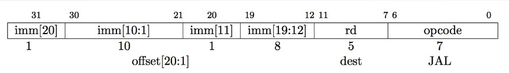

`jal` saves PC+4 in `rd`. 

`j` is short for `jal x0 Procedure`.

`jalr rd, rs, immediate`:

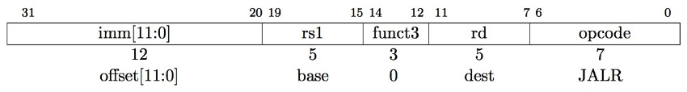

* writes PC+4 to `rd`
* Sets PC = rs + immediate

Example of `jalr`:

`ret = jr ra = jalr x0, ra, 0`

```assembly
# call function at any 32-bit absolute address
lui x1 <hi20bits>
jalr ra x1 <lo20bits>
```

### 2. Sum


Today's computers are built on two key principles:

* Instructions are represented as numbers
* Programs are stored in memory to be read or written, just like data

These princicples lead to the *stored-program* concept

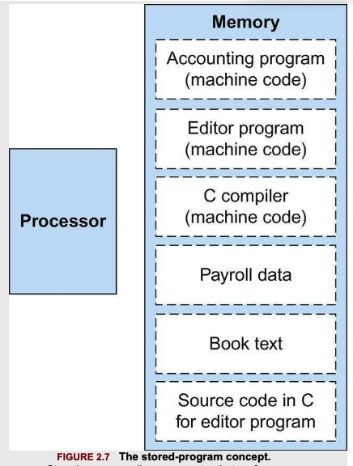

There are 6 basic types of instruction formats:

* R-format
* I-format
* S-format
* B-format
* U-format
* J-format

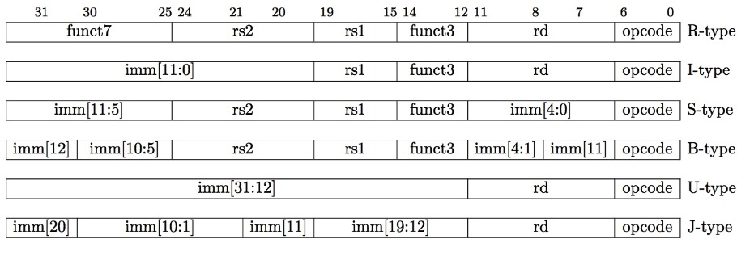


## 3. Logical Operations

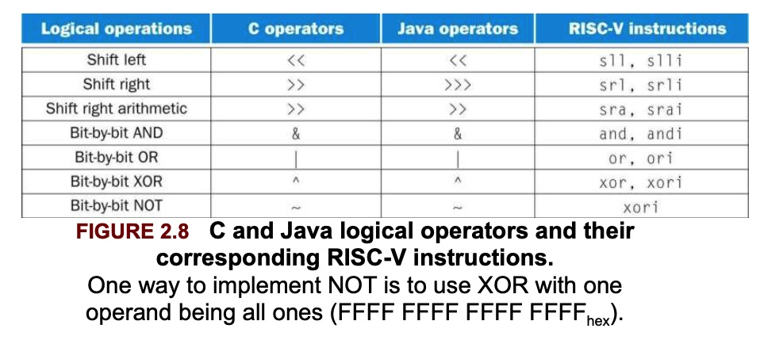

`slli`: shift left logical immediate

`srli`: shift right logical immediate

```assembly
slli x11, x19, 4	// reg x11 = reg x19 << 4 bits
```

This shift instruction use the I-type format. Only the lower 6 bits of the I-type format's 12-bit immediate are actually used. The remaining 6 bits are repurposed as an additional opcode field, func6.

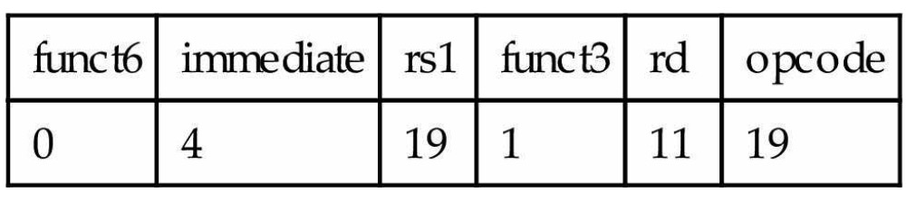

`srai`: shift right arithmetic immediate, it fills the vatated bits on the left with copies of the old sign bit.

## 4. Instructions for Making Decisions

### 4.1. Conditional Branches:

`beq`: branch if equal

```assembly
beq rs1, rs2, L1
```

`bne`: branch if not equal

```assembly
bne rs1, rs2, L1
```

Compiling a if-else in C:

```c
if (i == j)
  f = g + h;
else
  f = g - h;
```

The five variables `f` through `j` correspond to the five registers `x19` through `x23`.


```assembly
bne x22, x23, Else
add x19, x20, x21
beq x0, x0, Exit		// A: if 0 == 0, go to Exit
Else:sub x19, x20, x21
Exit:
```

A: We now need to go to the end of the `if`, so we introduce another kind of branch called `unconditional branch`.

### 4.2 Loops

Compiling a while Loop in C:

```c
while (save[i] == k)
  i += 1;
```

Assume that `i` and `k` correspond to registers `x22` and `x24` and the base of the array `save` is in `x25`.

```assembly
Loop: slli x10, x22, 3	// Temp reg x10 = i * 8
add x10, x10, x25		// x10 = address of save[i]
ld x9, 0(x10)		// Temp reg x9 = save[i]
bne x9, x24, Exit	// go to Exit if save[i] != k
addi x22, x22, 1	// i = i + 1
beq x0, x0, Loop	// A: go to Loop
Exit: 
```

A: The end of the loop branches back to the *while* test at the top of the loop

### 4.3 Other branches

`blt`: branch if less than

`bge`: branch if greater than or equal

`bltu`: unsigned version of `blt`, which treated the value as unsigned numbers

`bgeu`: the opposite case of `bltu`

### 4.4 Bounds Check Shortcut

Treating signed numbers as if they were unsigned gives us a low-cost way of checking if $0 \leq x < y$, which matches the index out-of-bounds check for arrays.

```assembly
bgeu x20, x11, IndexOutOfBounds		// if x20 >= x11 or x20 < 0, go to IndexOutOfBounds
```

## 5. Supporting Procedures in Computer Hardware

### 5.1 jump and link

Procedures allow the programmer to concentrate on just one portion of the task at a time. Procedures are one way to implement **abstraction** in software

In the execution of a procedure, the program must follow the six step:

1. Put parameters in a place where the procedure can access them
2. Transfer control to the procedure
3. Acquire the storage resources needed for the procedure
4. Perform the desired task
5. Put the result value in a place where the calling program can access it
6. Return control to the point of origin, since a procedure can be called from several points in a program.

RISC-V follows the following convention for procedure calling in allocating its 32 registers:

`x10-x17`: 8 parameter registers in which to pass parameters or return values.

`x1`: one return address register to return to the point of origin.

`jal`: jump and link

```assembly
jal x1, ProcedureAddress	// jump to ProcedureAddress and write return address to x1
```

This link, stored in register `x1` is called the **return address**. 

To support the return from a procedure, computers like RISC-V use an indirect jump:

```assembly
jalr x0, 0(x1)
```

This jump and link register instruction branches to the address stored in register `x1`. Then, the calling program, or **caller**, puts the parameter values in `x10-x17` and uses `jal x1, x` to branch to procedure `x` (sometimes called the **callee**). The callee then performs the calculations, places the results in the same parameter registers, and return control to the caller using `jalr x0, 0(x1)`.

Program counter(PC): The register containing the address of the instruction in the program being executed.

The jump and link instruction can also be used to perform an unconditional branch within a procedure by using `x0` as the destination register. Since `x0` is hard-wired to zero, the effect is to discard the return address:

```assembly
jal x0, Label
```

### 5.2 stack pointer

Suppose a compiler needs more registers for a procedure than the 8 argument registers. Since we must cover our tracks after our mission is complete, any registers needed by the caller must be restored to the values that they contained before the procedure was invoked. 

The ideal data structure for spilling registers is a **stack**. In RISC-V, the **stack pointer** is register `x2`, also known as the name `sp`. 

By historical precedent, stacks grow from higher addresses to lower addresses. This means that you push values onto the stack by substracting from the stack pointer.

Compiling a C procedure:

```c
long long int leaf_example(long long int g, long long int h, long long int i, long long int j) {
  long long int f;
  f = (g + h) - (i + j);
  return f;
}
```

Assume `g, h, i, j` correspond to the argument registers `x10, x11,x12, x13` and `f` corresponds to `x20`.  

The compiled program starts with the label of the procedure:

```assembly
leaf_example:
```

Then we need save the registers used by the procedure: push the old values onto the stack by creating space for 3 doublewords (24 bytes) on the stack and then store them:

```assembly
addi sp, sp, -24	// adjust stack to make room for 3 items
sd x5, 16(sp)	// save x5 for use afterwards
sd x6, 8(sp)	// save x6 for use afterwards
sd x20, 0(sp)	// save x20 for use afterwards
```

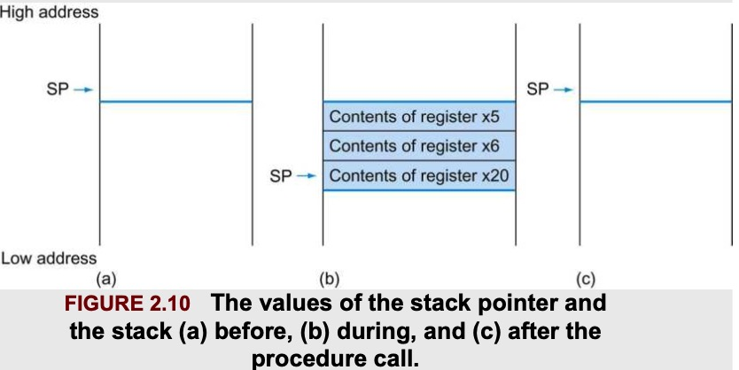
Then:

```assembly
add x5, x10, x11
add x6, x12, x13
sub x20, x5, x6
addi x10, x20, 0	// return f (x10 = x20 + 0)
```

Before returning, we restore the three old values of the registers we saved:

```assembly
ld x20, 0(sp)
ld x6, 8(sp)
ld x5, 16(sp)
addi sp, sp, 24	// adjust stack to delete 3 items
jalr x0, 0(x1)	// branch back to calling routine
```

To avoid saving and restoring a register whose value is never used, which might happen with a temporary register, RISC-V separates 19 of the registers into 2 groups:

* `x5-x7` and `x28-x31`: temporary registers that are not preserved by the callee(called procedure) on a procedure call
* `x8-x9` and `x18-x27`: saved registers that must be preserved on a procedure call.

In the example above, we can drop `x5,x6` stores and loads.

### 5.3 nested procedures

Suppose that the main program calls procedure A with an argument of 3, by placing the value into register `x10`, and then using `jal x1, A`. Then suppose A calls procedure B via `jal x1,B` with an argument 7, also placed in `x10`. Since A hasn't finished its task yet, there is a conflict over the use of `x10`. Also, there is a conflict over the return address in `x1`, since it now has the return address for `B`. This conflict will eliminate procedure A's ability to return its caller.

One solution is to push all the other registers that must be preserved on the stack.

Compiling a Recursive C Procedure:

```c
long long int fact(long long int n) {
  if (n < 1)
    return 1;
  else
    return n * fact(n-1);
}
```

Assume n corresponds to `x10`.

```assembly
fact:
	addi sp, sp, -16
	sd x1, 8(sp)	// save the return address
	sd x10, 0(sp)
```

The first time `fact` is called, `sd` saves an address in the program that called `fact`. Next we test whether `n` is less than 1.

```assembly
addi x5, x10, -1	// x5 = n - 1
bge x5, x0, L1	// if (n - 1) >= 0, go to L1
```

If `n` is less than 1, `fact` returns 1 by putting 1 into `x10`.

```assembly
addi x10, x0, 1	// return 1
addi sp, sp, 16	// pop 2 items off stack
jalr	// return to caller
```

If `n` is not less than 1, `n` is decremented and then `fact` is called again with the decremented value:

```assembly
L1: addi x10, x10, -1	// n >= 1: argument gets(n - 1)
	jal x1, fact	// call fact with (n - 1)
```

The next instruction is where `fact` returns; its result is in `x10`. 

```assembly
addi x6, x10, 0	// return from jal: move result of fact(n - 1) to x6
ld x10, 0(sp)	// restore argument n
ld x1, 8(sp)	// restore the return address
addi sp, sp, 16
```

Next, `x10` gets the product of the old argument and the result of fact(n - 1)

```assembly
mul x10, x10, x6	// return n * fact(n - 1)
jalr x0, 0(x1)	// return to the caller
```

To simplify access to static data, some RISC-V compilers reserve `x3` for use as the **global pointer**, or `gp`

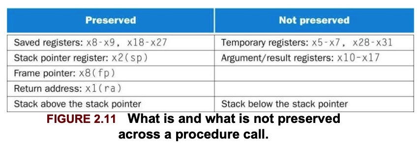

### 5.4 Allocating space for new data on the stack

Stack is also used to store variables that are local to the procedure but do not fit in registers, such as local arrays or structures.  The segment of the stack containing a procedure's saved registers and local variables is called a **procedure frame** or **activation record**.

Some RISC-V compilers use a **frame pointer** `fp`, or `x8` to point to the first doubleword of the frame of a procedure. A stack pointer might change during the procedure, and so references to a local variable in memory might have different offsets depending on where they are in the procedure, making the procedure harder to understand. A frame pointer offers a stable base register within a procedure for local memory-references.

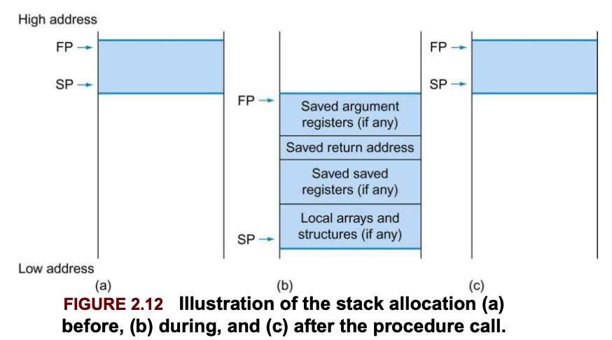

## 5.5 Allocating space for new data on the heap

In addition to automatic variables that are local to procedures, C needs space in memory for static variables and for dynamic data structures. The stack starts in the high end of the user addresses space and grows down. 

The first part of the low end of memory is reserved, followed by the home of the RISC-V machine code, called **text segment**. Above the code is the *static data segment*, which is the place for constants and other static variables. Arrays tend to be fixed length and thus belong to static data segment, while linked lists can grow and shrink, they belong to *heap*. 

Note that stack and heap grow toward each other.

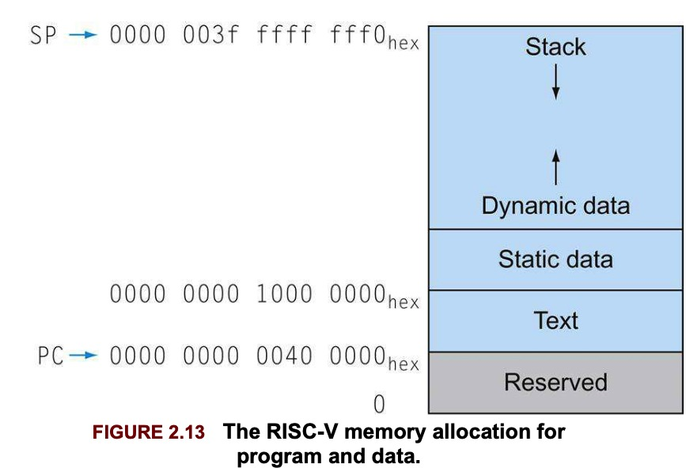

If there are more than 8 parameters, the RISC-V will put the extra parameters on the stack just above the frame pointer.

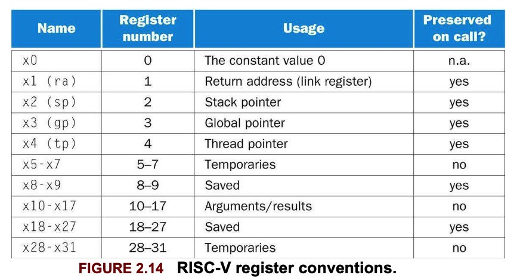

Some recursive procedures can be implemented iteratively with no need to push registers into stack. 

```c
long long int sum(long long int n, long long int acc) {
  if (n < 0)
    return sum(n - 1, acc + n);
  else
    return acc;
}
```

This is called *tail recursion*, which can be implemented very efficiently (assume `x10 = n, x11 = acc`, and the result goes into `x12`)

```assembly
sum:
	ble x10, x0, sum_exit	// go to sum_exit if n <= 0
	add x11, x11, x10	// add n to acc
	addi x10, x10, -1
	jal x0, sum
sum_exit:
	addi x12, x11, 0	// return value acc
	jalr x0, 0(x1)	// return to caller
```

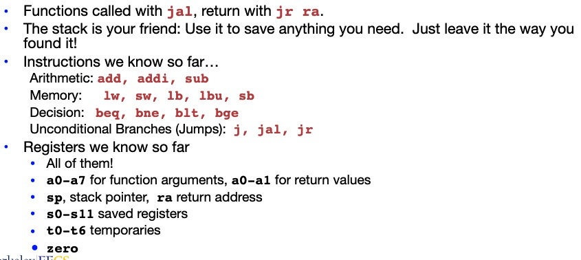

Compile the following C code:

```c
typedef struct list {
  void *car;
  struct list *cdr;
}List;

List *map(List *src, void * (*f) (void *)) {
  List *ret;
  if (!src)
    return 0;
  ret = (List *) malloc(sizeof(List));
  ret->car = (*f)(src->car);
  ret->cdr = map(src->cdr, f);
  return ret;
}
```

Assume `s0: src, s1: f, s2: ret`

Preamble:

```assembly
map:
	addi sp sp -16	# need to store 4 entries
	sw ra 12(sp)
	sw s0 8(sp)
	sw s1 4(sp)
	sw s2 0(sp)
	mv s0 a0	# save src
	mv s1 a1	# save f
```

Body:

```assembly
bne a0 x0 map_skip_if
mv a0 x0	# return 0
j map_return
map_skip_if:
	li a0 8					# sizeof(List)
	jal ra malloc		# call malloc
	mv s2 a0				# save ret
	lw a0 0(s0)			# src->car
	jal ra s1			  # call f
	sw a0 0(s2)			# ret->car assigned
	lw a0 4(s0)			# src->cdr
	mv a1 s1				# f
	jal ra map			# recursive call
	sw a0 4(s2)			# store to ret->cdr
	mv a0 s2
map_return:
	lw ra 12(sp)
	lw s0 8(sp)
	lw s1 4(sp)
	lw s2 0(sp)
	addi sp sp 16
	jalr x0 ra
```

## 6

Everything has a memory address:

* Since all instructions and data are stored in memory, everything has a memory address: instructions, data words...
* One register keeps address of instruction being executed: Program Counter(PC)
  * Basically a pointer to memory
  * Intel calls it Instruction Pointer

