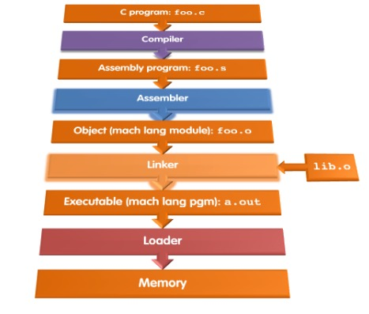

This is about Compiler, Assembler, Linker, Loader(CALL)

## 1. Integer Multiplication

## 2. Interger division

## 3. Interpretation vs Compilation




### 3.1 Compiler

The compiler transforms the C program into an *assembly language program*, a symbolic form of what the machine understands. 


### 3.2 Assembler
**Pseudoinstructions**: A common variation of assembly language instructions often treated as if it were an instruction in its own right.

```assembly
li x9 123		# load immediate value 123 into x9
# the same as
addi x9 x0 123
```

```assembly
mv x10 x11	# x10 gets x11
# the same as
addi x10 x11 0
```

The assembler also accepts `j Label` to unconditionally branch to a label as a stand-in for `jal x0 Label`

Using pse... can simplify your task.

The assembler turns the assembly language program into an *object file*, which is a combination of machine language instructions, data, and information needed to place instructions properly in memory.

Assemblers keep track of labels used in branches and data transfer instructions in a **symbol table**.

The object file for UNIX systems typically contains 6 distinct pieces:

* *object file header*
* *text segment*
* *static data segement*
* *relocation information*
* *symbol table*
* *debugging information*

### 3.3 Linker

**Linker** is a systems program that combines independently assembled machine language programs and resolves all undefined labels into an executable file.

Three steps of the linker:

1. Place code and data modules symbolically in memory
2. Determine the address of data and instruction labels
3. patch both the internal and external references

The linker uses the relocation information and symbol table in each object module to resolve all undefined labels. 

If all external references are resolved, the linker next determines the memory locations each module will occupy. 

The linker produces an **executable file** that can be run on a computer. 

### 3.4 Loader

Loader: A systems program that places an object program in main memory so that it is ready to execute

### 3.5 Dynamically Linked Libraries

Util now, we introduce a traditional way to link libraries before the program is run. Although this static approach is the fastest way to call library routines, it has few disadvantages:

* the library routines become part of the executable code
* it loads all routines in the library that are called anywhere in the executable, even if those calls are not executed.

These disadvantages lead to **dynamically linked libraries(DLLs)**, where the library routines are not linked and loaded until the program is run.

In the lazy procedure linkage version of DLLs, each routine is linked only after it is called. This trick relies on a level of indirection.


## 4. Producing Machine Language

